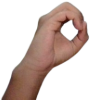
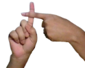
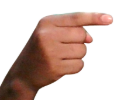
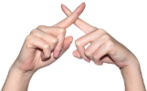
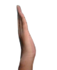
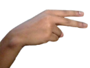
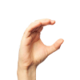

# Gesture Calculator

A modern, interactive calculator powered by hand gesture recognition using computer vision and machine learning and some ruling based detection. Perform arithmetic operations only your webcam and hand gestures—no keyboard or mouse required for interaction!

## Features

- **Gesture-Based Arithmetic:** Perform addition, subtraction, multiplication, division, and clear operations using hand gestures.
- **Real-Time Recognition:** Instantly see your hand gestures detected and processed via the webcam.
- **Intuitive UI:** Split-screen layout displays both your webcam feed and calculation results.
- **Visual Feedback:** Results and recognized gestures are shown with clear, color-coded overlays for easy understanding.
- **Landmark Visualization:** Hand landmarks are displayed directly on your hand with multi-colored lines, making gesture detection transparent and interactive.

## Getting Started

### Prerequisites
- Python 3.8–3.12 (Because Mediapipe does not support Python 3.13+ as of September 2025)
- Webcam

### Installation
1. Clone the repository:
	 ```sh
	 git clone https://github.com/debabratasaha-dev/gesture-calculator.git
	 cd gesture-calculator
	 ```
2. Install dependencies:
	 ```sh
	 pip install -r requirements.txt
	 ```

### Usage
- Run the main application:
	```sh
	python app.py
	```
> **Note:**
> Check your webcam device number! By default, the code uses `cap = cv2.VideoCapture(0)` (see line 13 in `app.py`). If you have multiple webcams or your device uses a different index, change `0` to the correct number for your setup.
## Project Structure
```
Gesture Calculator/
├── app.py                  # Main calculator and gesture logic
├── calculate.py            # Arithmetic operation logic
├── requirements.txt        # Python dependencies
├── README.md               # Project documentation
├── operations.task         # ML model for operation detection
├── Gesture_pictures         # Pictures of the Gestures
```

## How It Works
- Uses Mediapipe for real-time hand tracking and gesture recognition.
- ML models (.task files) classify hand gestures for calculator operations.
- Split-screen UI shows both webcam and result prompts.

## Supported Gestures
- Numbers (0–9)
- User your fingers for 1-10 detection
- Operations: plus, minus, multiply, divide, equal, clear
### Gestures
<!-- place inside your README.md -->
<div style="display:flex; flex-wrap:wrap; gap:12px; align-items:flex-start;">
  <figure style="margin:0; text-align:center;">
    
    <figcaption style="font-size:12px; margin-top:6px;"><strong>0</strong></figcaption>
  </figure>

  <figure style="margin:0; text-align:center;">
    
    <figcaption style="font-size:12px; margin-top:6px;"><strong>+ (Plus)</strong></figcaption>
  </figure>

  <figure style="margin:0; text-align:center;">
    
    <figcaption style="font-size:12px; margin-top:6px;">- (Minus)</figcaption>
  </figure>
  <figure style="margin:0; text-align:center;">
    
    <figcaption style="font-size:12px; margin-top:6px;">* (Multiply)</figcaption>
  </figure>
  <figure style="margin:0; text-align:center;">
    
    <figcaption style="font-size:12px; margin-top:6px;">/ (Divide)</figcaption>
  </figure>
  <figure style="margin:0; text-align:center;">
    
    <figcaption style="font-size:12px; margin-top:6px;">= (Equal)</figcaption>
  </figure>
  <figure style="margin:0; text-align:center;">
    
    <figcaption style="font-size:12px; margin-top:6px;">Clear</figcaption>
  </figure>

  <!-- add more figures as needed -->
</div>

## Troubleshooting
- **Python Version:** Use Python 3.8–3.12. Mediapipe is not available for Python 3.13+.
- **Webcam Issues:** Ensure your webcam is connected and accessible.
- **Model Files:** Place all required `.task` model files in the project directory.

## Acknowledgements
- [Mediapipe](https://ai.google.dev/edge/mediapipe/solutions/guide) for hand tracking and gesture recognition
- OpenCV for image and video processing
---